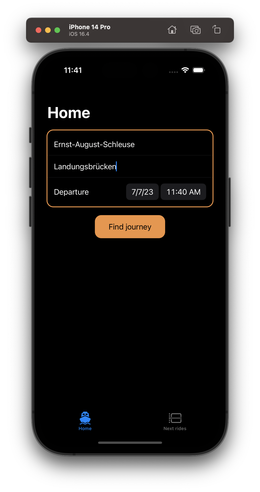
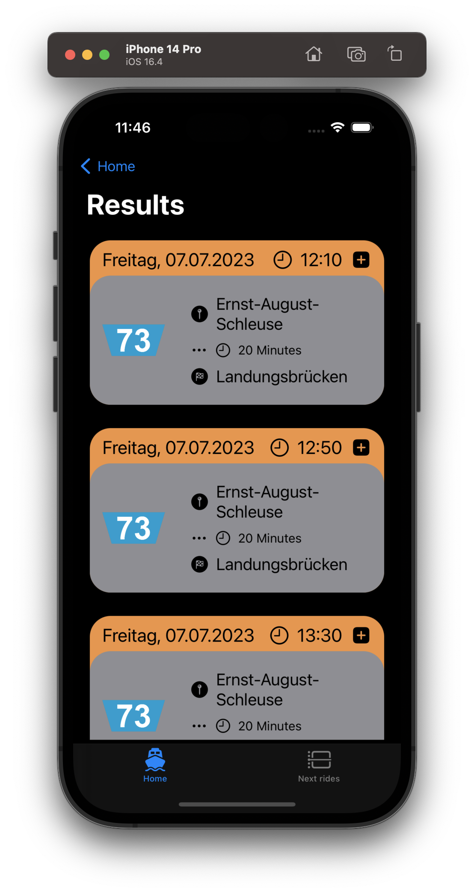
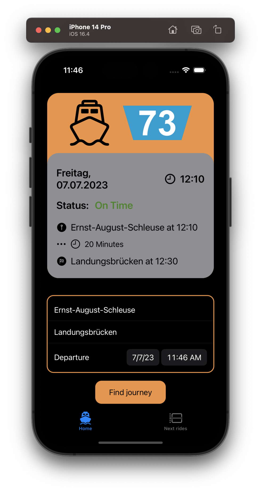
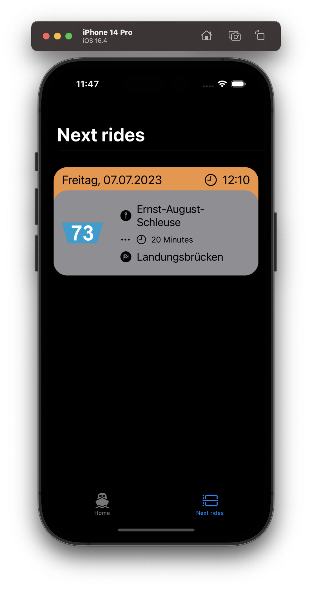

# FaehrtSie-iOS - Let's track a ferry!

**LOGO**

## The App

### Screenshots

   

## About the project

If you are living in Hamburg-Wilhelmsburg or on the Elbinsel, you might (or might not) have heard of the HVV *(HADAG)* Ferry Line 73, which operates between "Ernst-August-Schleuse" and "Landungsbrücken" on Weekdays approximately every 40 Minutes. Due to outside conditions, the fact that you can board one of the ferries at "Ernst-August-Schleuse" unfortunately is not guaranteed, due to Weather or HADAG operating issues. 

Due to missing information about the exact schedule and any exceptions derivating from it, this App is meant to inform you about any possible delay via push notifications and status updates on your Journey. 

## Copyright / Legal

This project is licensed under the GPLv3 (GNU General Public License v3) License.
